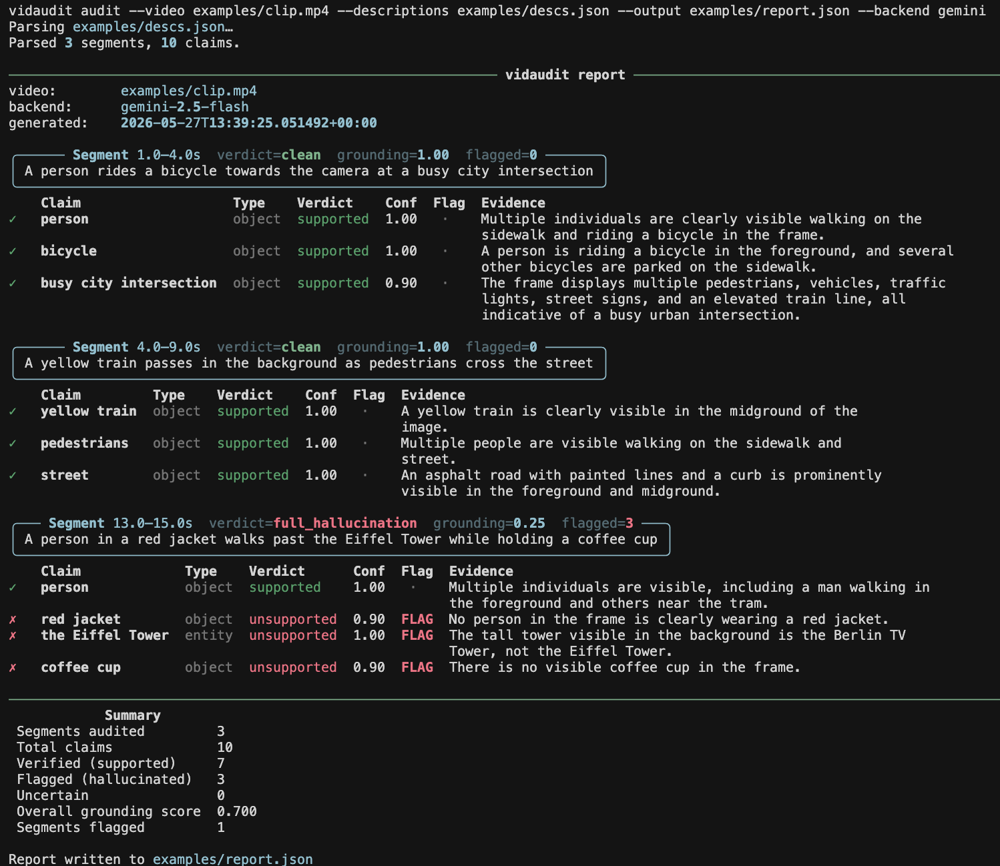

# vidaudit

**Audit VLM-generated video descriptions for hallucinations.**

vidaudit checks time-coded video descriptions against the frames they actually describe. Give it a video and a set of timestamped descriptions (JSON); it samples a frame at each timestamp, decomposes every description into individual verifiable **claims** (objects, named entities, attributes), and asks a vision-language model one binary question per claim: *"Is this visible in this frame?"* The output is a structured report with a grounding score per segment and a flag on every claim the model could not confirm.



> The run above clears the grounded claims, miscounts nothing it can see, and flags the three fabrications: the Berlin TV Tower labeled as the Eiffel Tower, a red jacket that is not there, and a coffee cup that is not there.

## Why it exists

Production video-indexing systems generate automated time-coded descriptions of footage. Those descriptions sometimes hallucinate: they name objects, people, or landmarks that are not on screen. Catching that today means trusting the model that wrote the description, or paying a person to re-watch the clip.

Academic work in this space (VideoHallucer, ViBe, MESH) ships benchmarks and datasets, not a tool you can point at your own videos. vidaudit is that tool: a small, inspectable CLI you clone and run.

## How it works: claims, not text comparison

The obvious approach is to generate a second caption and compare the two texts. That compares two noisy outputs, so the errors compound and the result is not quantifiable.

vidaudit does the opposite. It breaks the description into independent claims and verifies each one against the frame with a binary question. Every check is independent, scorable, and carries its own confidence:

```
video.mp4 + descriptions.json
  -> description_parser   spaCy noun-phrase + NER claim extraction
  -> frame_sampler        ffmpeg frame-accurate extraction, span-aware sampling
  -> object_audit         per-claim binary VLM verification, context-frame rescue
        -> vlm backend     batched, structured output, cached verdicts
  -> report               JSON report + terminal summary
```

Claim extraction is deterministic (spaCy, not a second LLM), so the only stochastic step is the binary verification, and that step is cached. The full set of design decisions and their tradeoffs lives in [DESIGN.md](DESIGN.md).

## Results

vidaudit is built to be measured, so the headline is a benchmark rather than a feature list. The eval runs every sample through two verifier models, open-weight **Qwen2.5-VL-3B** and **Gemini 2.5 Flash**, plus the text-comparison baseline. The numbers below come from a FineVideo pilot of 5 videos: 75 synthetic samples (41 planted hallucinations, 34 clean) and 30 hand-labeled real captions (6 hallucinated, 24 clean).

**Which model is the better auditor (synthetic subset):**

| Auditor | Precision | Recall | F1 |
|---|---:|---:|---:|
| vidaudit, Qwen2.5-VL-3B (open) | **0.97** | 0.71 | **0.82** |
| vidaudit, Gemini 2.5 Flash | 0.63 | 0.88 | 0.73 |
| text-comparison baseline | 0.55 | 1.00 | 0.71 |

The open-weight 3B model is the most precise auditor and wins on F1. The text baseline flags almost everything (recall 1.00, precision 0.55); decomposing into claims is what buys the precision.

**Can a model audit its own output (real subset, captions generated by Qwen):**

| Auditor | Role | Caught | Precision | Recall | F1 |
|---|---|:--:|---:|---:|---:|
| vidaudit, Qwen | self-audit | 0 / 6 | 0.00 | 0.00 | 0.00 |
| vidaudit, Gemini | cross-audit | 3 / 6 | 0.27 | 0.50 | 0.35 |
| text-comparison baseline | n/a | 6 / 6 | 0.20 | 1.00 | 0.33 |

Asked to verify claims pulled from its own captions, the model confirms all of them and catches nothing. An independent model recovers half. **A model cannot reliably audit itself**, which is the result that matters most if you plan to QA a generation model with the same model family.

Two more findings come out of the confidence sweep:

- **Calibration differs sharply.** Qwen's confidence is discriminative: F1 peaks across thresholds 0.2 to 0.4, and the shipped default of 0.3 sits on that plateau. Gemini reports high confidence on nearly every verdict, so its confidence cannot be used to gate decisions.
- **Extraction is not the bottleneck.** 95% of planted spans are extracted as claims, so the recall ceiling is verification quality, not spaCy.

This is a pilot with 6 real positives, so the real-subset numbers are directional, not significant. Reproduce or extend it with [`notebooks/eval_demo.ipynb`](notebooks/eval_demo.ipynb).

## How the eval works

The eval is designed so that a low score is attributable rather than mysterious:

- **Baseline comparison.** Claims-decomposition is scored against the "re-caption and diff the texts" approach it argues against, on the same samples.
- **Plausible synthetic mutations, not random ones.** An object swap goes to a likely co-occurring object (`dog` to `cat`), alongside colour and size changes and named-entity injection. Random swaps are trivially detectable and would inflate the numbers. The swap tables are hand-curated and auditable.
- **A real-hallucination subset.** Frames are captioned by one model, its natural errors are kept, and each is hand-labeled against the frame. Synthetic mutations alone do not resemble a real error distribution.
- **Self versus cross audit.** Because the real captions come from Qwen, the Qwen verifier is a self-audit and Gemini is a cross-audit; the gap between them is the self-consistency result above.
- **Subsets reported separately**, never averaged. **Extraction quality reported on its own**, so a low F1 is attributable to spaCy extraction versus VLM verification. **Thresholds derived from the sweep**, not asserted.

## Install

Requires **Python 3.10+**, **ffmpeg** (system install), and [`uv`](https://docs.astral.sh/uv/).

```bash
brew install ffmpeg          # macOS (apt install ffmpeg on Debian/Ubuntu)

git clone https://github.com/shaneopatrick/vidaudit.git
cd vidaudit
make install                 # uv sync + downloads the spaCy en_core_web_sm model
```

The default Gemini backend needs an API key:

```bash
cp .env.example .env         # then add your GEMINI_API_KEY
```

## Usage

```bash
# Full audit: writes a JSON report and prints the terminal summary shown above
vidaudit audit \
  --video examples/clip.mp4 \
  --descriptions examples/descs.json \
  --output report.json

# Just show the extracted claims, no VLM calls (useful for debugging extraction)
vidaudit parse --descriptions examples/descs.json
```

Descriptions are a JSON array of timestamped segments. `timestamp_end` is optional; a missing end is inferred from the next segment's start, or from the video duration for the final segment.

```json
[
  {
    "timestamp_start": 12.5,
    "timestamp_end": 18.0,
    "description": "A woman in a red jacket walks past the Eiffel Tower"
  }
]
```

Key flags: `--backend {gemini,qwen}`, `--confidence-threshold`, `--clean-threshold`, `--partial-threshold`, `--max-segment-span`, `--qwen-revision`, `--qwen-4bit`. Run `vidaudit audit --help` for the full list.

## Backends

| Backend | Model | Role |
|---|---|---|
| **Qwen2.5-VL** | `Qwen/Qwen2.5-VL-3B-Instruct` (open-weight) | Canonical; reported metrics run here |
| **Gemini** | `gemini-2.5-flash` | Dev convenience and no-GPU fallback |

The canonical backend is the open-weight model for two reasons. It is reproducible: a checkpoint is frozen by hash, where a hosted model ID can change behavior underneath you. And running the eval on it turns the cross-model comparison itself into a result. Gemini stays for fast local iteration on machines without a GPU.

The Qwen backend is GPU-bound, so run it in Colab. See [`notebooks/qwen_smoke.ipynb`](notebooks/qwen_smoke.ipynb) for a one-clip smoke test and [`notebooks/eval_demo.ipynb`](notebooks/eval_demo.ipynb) for the full benchmark.

## Project layout

```
vidaudit/   the package: parser, sampler, auditor, backends, report, CLI
eval/       FineVideo loader, synthetic mutations, captioners, eval runner
notebooks/  Colab: qwen_smoke (one clip), eval_demo (cross-model benchmark)
tests/      pytest, with the VLM and ffmpeg always mocked
```

## Development

```bash
make check        # ruff format + lint, mypy, pytest; run before committing
make test
make lint
make typecheck
```

Tests never hit a real VLM API or require a real video: subprocess and SDK calls are mocked, and a fake backend drives the auditor.

## Limitations

vidaudit verifies static, single-frame claims (objects, entities, attributes). Action and temporal claims, such as "the tram *passes* another" or event ordering, need multi-frame reasoning and are out of scope for now. A planned next step is a separate action-verifier path over densely sampled frames. See [BACKLOG.md](BACKLOG.md) for the worked example and roadmap.

## License

MIT. See [LICENSE](LICENSE).
